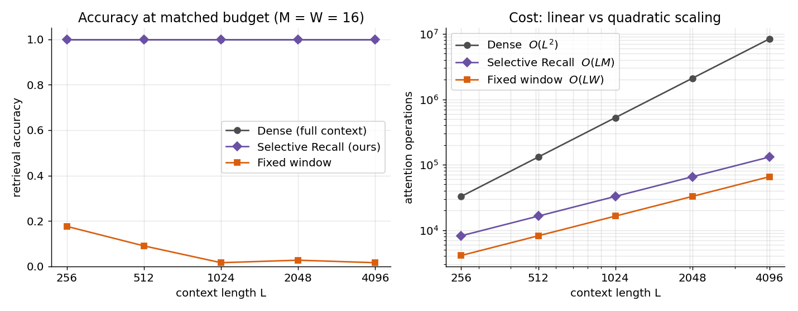
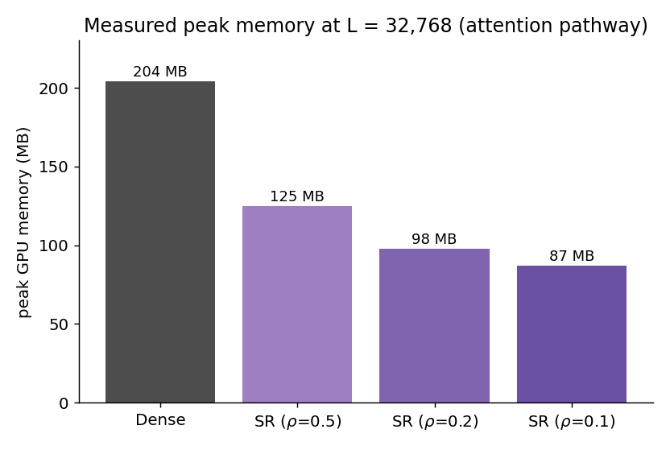
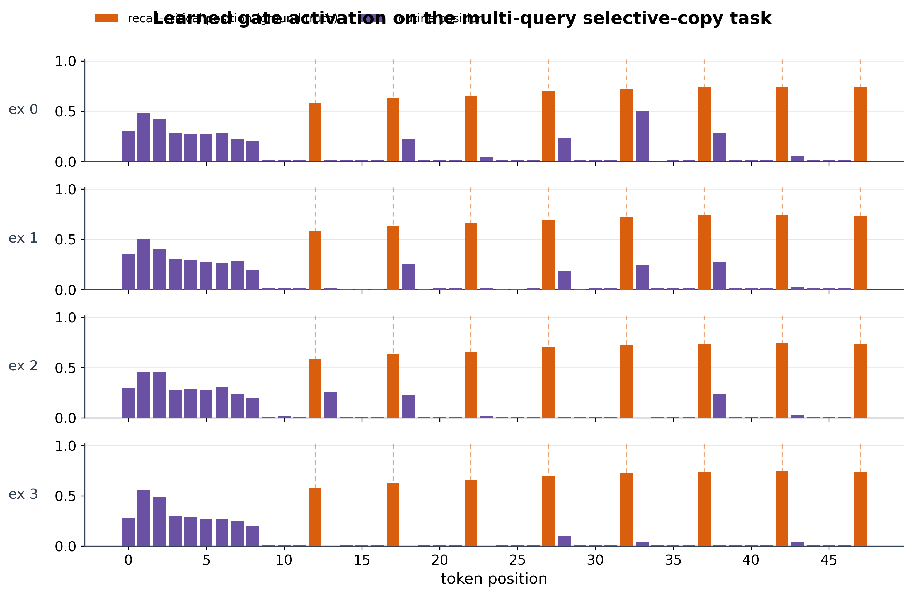

# Selective Recall

**A learned bounded-memory attention mechanism for efficient long-context retrieval.**

Attention gives exact access to any earlier token, but its cost and its key-value
cache both grow with the square of the context length. State-space models are cheap
but keep only a lossy summary and cannot reproduce a specific distant token. Selective
Recall targets the gap for **long-context retrieval**: it compresses a long sequence
into a small, fixed number of memory slots through a learned write, and answers queries
by attending only over those slots. The memory footprint is constant in context length
and the attention cost is linear instead of quadratic.

This repository contains the implementation, the benchmarks, and Colab notebooks that
reproduce every result below on a single GPU.

---

## Key results (measured on GPU)

On a controlled long-context retrieval task, a distinctive token is placed at a random
position in a long sequence of filler, and a query at the end must reproduce it. Three
mechanisms are compared at a **matched budget** (memory size `M` = window width `W` = 16):
`dense` full attention (the accuracy ceiling), a `fixed window` (a naive bounded
baseline), and `Selective Recall` (the learned bounded memory).

**Selective Recall matches full attention while a fixed window at the same budget
collapses, at a fraction of the cost.**



| Context `L` | Dense | Fixed window | Selective Recall | SR cost vs dense |
|---|---|---|---|---|
| 256  | 1.000 | 0.176 | **1.000** | 4× fewer ops |
| 512  | 1.000 | 0.090 | **1.000** | 8× fewer ops |
| 1024 | 1.000 | 0.016 | **1.000** | 16× fewer ops |
| 2048 | 1.000 | 0.027 | **1.000** | 32× fewer ops |
| 4096 | 1.000 | 0.016 | **1.000** | 64× fewer ops |

Dense accuracy is 1.000 at every length, which confirms the task is learnable and that
the window's failure is a failure of the mechanism, not of the task. The window degrades
as the context grows because a randomly placed token is almost never inside the last 16
positions. Selective Recall holds at 1.000 across a full order of magnitude of context
length, so the learned memory keeps the salient token wherever it appears.

**The bounded memory keeps a constant footprint.** Directly measured peak memory of the
attention pathway at a context of 32,768 tokens, in half precision, against the fused
(FlashAttention) dense kernel:



Dense attention uses 204 MB; Selective Recall uses 87 MB at an attending fraction of
0.1. The dense footprint reflects the key-value cache that grows with context, while
Selective Recall keeps a fixed memory.

**A learned gate identifies which positions need recall.** On a task with ground-truth
recall-critical labels, the gate reaches precision ≈ 0.90 and recall ≈ 1.00 at an
attending fraction ≈ 0.20, versus ≈ 0.17 / ≈ 0.20 for a uniform gate. It fires on the
positions that matter and stays low elsewhere.



---

## Scope

These results are for **retrieval of a single salient distant item**, a single training
seed, and the attention/memory mechanism evaluated in isolation. This setting isolates
the capability under study and provides a ground-truth label for the gate. It does **not**
establish behavior when many items must be recalled at once, on natural language, or
within a full model with a recurrent backbone. See [Limitations](#limitations-and-future-work).

---

## Repository structure

```
selective-recall/
├── selective_recall/            # installable package
│   ├── config.py                # CFG (all knobs)
│   ├── data.py                  # synthetic recall task
│   ├── models.py                # SSM, attention, gate, block, model
│   ├── train.py                 # training loop + evaluation
│   ├── experiments.py           # drivers (run_all, sweeps)
│   └── plots.py                 # figures
├── benchmarks/
│   ├── experiment_accuracy_cost.py  # accuracy + cost: dense vs window vs SR memory
│   └── benchmark_attention.py       # measured latency and peak memory vs context
├── notebooks/                   # Colab-ready, one per result
│   ├── Selective_Recall_accuracy_cost.ipynb
│   ├── Selective_Recall_benchmark.ipynb
│   ├── Selective_Recall_capacity.ipynb
│   ├── Selective_Recall_capacity_law.ipynb
│   └── Selective_Recall_experiment.ipynb
├── scripts/                     # command-line entry points
├── tests/                       # fast pytest smoke tests
└── docs/                        # figures + figure-generation script
```

---

## Installation

Requires Python 3.9+ and PyTorch 2.0+.

```bash
git clone https://github.com/your-username/selective-recall.git
cd selective-recall
pip install -e .
# for tests:
pip install -e ".[dev]" && pytest -q
```

---

## Reproducing the results

Every result maps to a notebook (easiest, Colab) and a script. Set a **GPU** runtime for
the long-context and memory measurements.

| Result | Notebook | Script |
|---|---|---|
| Accuracy and cost vs context length (headline) | `notebooks/Selective_Recall_accuracy_cost.ipynb` | `python benchmarks/experiment_accuracy_cost.py --L 256 512 1024 2048 4096 --K 1 --budget 16` |
| Measured latency and peak memory vs context | `notebooks/Selective_Recall_benchmark.ipynb` | `python benchmarks/benchmark_attention.py --L 1024 2048 4096 8192 16384 32768` |
| Gate diagnostic and interpretable routing | `notebooks/Selective_Recall_experiment.ipynb` | `python scripts/run_experiment.py` |
| Bounded-memory capacity stress test | `notebooks/Selective_Recall_capacity.ipynb` | — |
| Memory-size scaling sweep | `notebooks/Selective_Recall_capacity_law.ipynb` | — |

The figures in this README are produced by `docs/make_readme_figs.py` from the measured
numbers; run `python docs/make_readme_figs.py` to regenerate them.

**Notes on running.** Inside a notebook, run the cells directly and do not paste the
`if __name__ == "__main__"` block of a script into a cell (the command-line parser will
reject the kernel's arguments). Long contexts need a GPU; on CPU the runs work but are
slow and the fused attention kernel is not used, so CPU timing does not reflect the GPU
picture.

---

## Method in brief

- **Bounded memory.** `M` learned slot vectors cross-attend over the sequence to form
  `M` memory vectors. The write is fully differentiable, so the slots learn to route
  salient content into the memory. This differentiable compression is what makes the
  memory trainable; a hard top-`M` token selection does not train, because unselected
  tokens receive no gradient.
- **Query path.** Queries attend over the `M` memory slots rather than the full context,
  which turns the quadratic read of full attention into a linear read.
- **Recall gate.** A lightweight per-token gate predicts which positions need exact
  recall, trained with a straight-through estimator and a one-sided budget penalty, under
  a two-phase schedule that keeps the gate open until the read path is useful and then
  anneals the budget in.
- **Complexity.** Attention cost `O(L·M)` (linear in `L`) versus `O(L²)` for dense;
  memory `O(M)` (constant in `L`) versus a growing `O(L)` key-value cache.


```

## License

MIT. See [LICENSE](LICENSE).
